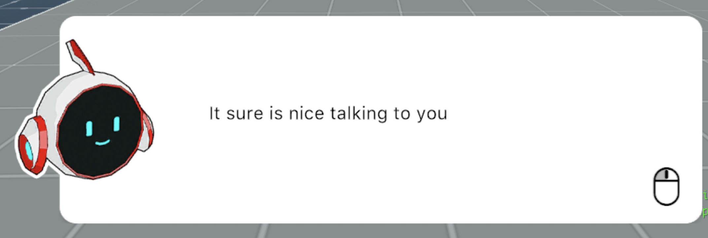
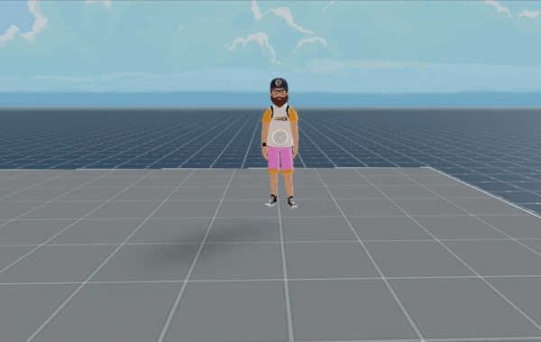
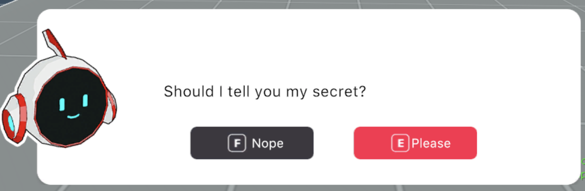
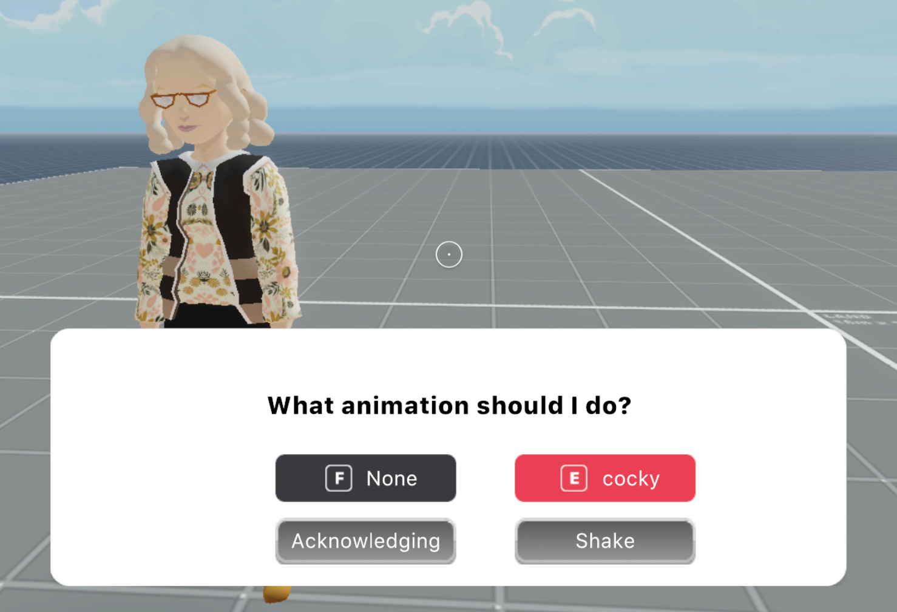

# NPC-library

A collection of tools for creating Non-Player-Characters (NPCs). These are capable of having conversations with the player, and play different animations.

Capabilities of the NPCs in this library:

- Start a conversation when clicked or when walking near
- Trigger any action when clicked or when walking near
- Trigger any action when the player walks away
- Turn around slowly to always face the player
- Play an animation in the NPC 3d model, optionally returning to loop the idle animation afterwards

The dialog messages can also require that the player chooses options, and any action can be triggered when the player picks an option or advances past a message.

To use NPCs in your scene:

1. Install the library as an npm package. Run this command in your scene's project folder:

```
npm i @dcl/npc-utils
```

2. Import the library into the scene's script. Add this line at the start of your `game.ts` file, or any other TypeScript files that require it:

```ts
import { NPC } from '../node_modules/@dcl/npc-utils/index'
```

3. In your TypeScript file, create an `NPC` type object, passing it at least a position, a path to a 3d model, and a function to trigger when the NPC is activated:

```ts
export let myNPC = new NPC(
	{ position: new Vector3(10, 0.1, 10) }, 
	'models/CatLover.glb', 
	() => {
	   myNPC.talk(ILoveCats, 0)
	}
)
```

4. Write a dialog script for your character, preferably on a separate file, making it of type `Dialog[]`.

```ts
import { Dialog } from '../../node_modules/@dcl/npc-utils/utils/types'

export let ILoveCats: Dialog[] = [
  {
    text: `I really lo-ove cats`,
    isEndOfDialog: true,
  },
]
```

## NPC Default Behavior

NPCs at the very least must have:

- `position`: (_TranformConstructorArgs_). Can include position, rotation and scale.
- `model`: (_string_) The path to a 3D model
- `onActivate()`: (_()=> void_) A function to call when the NPC is activated.

```ts
export let myNPC = new NPC({ position: new Vector3(10, 0.1, 10) }, 'models/CatLover.glb', () => {
  log('NPC activated!')
})
```

With this default configuration, the NPC behaves in the following way:

- The `onActivate()` function is called when the NPC is clicked, and when the player walks near at a distance of 6 meters.
- Once activated, there's a cooldown period of 5 seconds, that prevents the NPC to be activated again.
- After walking away from the NPC, if its dialog window was open it will be closed, and if the NPC was rotating to follow the player it will stop.
- If the NPC already has an open dialog window, clicking on the NPC won't do anything, to prevent accidentally clicking on it while flipping through the conversation.
- If the NPC has an animation named 'Idle', it will play it in a loop. If other non-looping animations are played, it will return to looping the 'Idle' animation after the indicated duration.

Many of these behaviors can be overriden or tweaked with the exposed properties.

## NPC Additional Properties

To configure other properties of an NPC, add a fourth argument as an `NPCData` object. This object can have the following optional properties:

- `idleAnim`: _(string)_ Name of the idle animation in the model. This animation is always looped. After playing a non-looping animation it returns to looping this one.
- `faceUser`: _(boolean)_ Set if the NPC rotates to face the user while active.
- `portrait`: _(string_ or _ImageData)_ 2D image to show on the left-hand side of the dialog window. The structure of an `ImageData` object is described in detail below.
- `darkUI`: _(boolean)_ If true, the dialog UI uses the dark theme.
- `dialogSound`: _(string)_ Path to sound file to play once for every line of dialog read on the UI.
- `coolDownDuration`: _(number)_ Change the cooldown period for activating the NPC again. The number is in seconds.
- `hoverText`: _(string)_ Set the UI hover feedback when pointing the cursor at the NPC. _TALK_ by default.
- `onlyClickTrigger`: _(boolean)_ If true, the NPC can't be activated by walking near. Just by clicking on it or calling its `activate()` function.
- `onlyExternalTrigger`: _(boolean)_ If true, the NPC can't be activated by clicking or walking near. Just by calling its `activate()` function.
- `reactDistance`: _(number)_ Radius in meters for the player to activate the NPC or trigger the `onWalkAway()` function when leaving the radius.
- `continueOnWalkAway`: _(boolean)_ If true,when the player walks out of the `reactDistance` radius, the dialog window stays open and the NPC keeps turning to face the player (if applicable). It doesn't affect the triggering of the `onWalkAway()` function.
- `onWalkAway`: (_()=> void_) Function to call every time the player walks out of the `reactDistance` radius.

The `ImageData` type that can be used on the `portrait` field is an object that may include the following:

- `path`: Path to the image file.
- `xOffset`: Offset on X, relative to the normal position of the image.
- `yOffset`: Offset on Y, relative to the normal position of the image.
- `width`: The width to show the image onscreen.
- `height`: The height to show the image onscreen.
- `section`: Use only a section of the image file, useful when arranging multiple icons into an image atlas. This field takes an `ImageSection` object, specifying `sourceWidth` and `sourceHeight`, and optionally also `sourceLeft` and `sourceTop`.

```ts
export let myNPC = new NPC(
  { position: new Vector3(10, 0.1, 10) },
  'models/CatLover.glb',
  () => {
    log('NPC activated!')
  },
  {
    idleAnim: `Weight_Shift`,
    faceUser: true,
    portrait: { path: 'images/catguy.png', height: 128, width: 128 },
    darkUI: true,
    coolDownDuration: 3,
    hoverText: 'CHAT',
    onlyClickTrigger: false,
    onlyExternalTrigger: false,
    reactDistance: 4,
    continueOnWalkAway: true,
    onWalkAway: () => {
      log('walked away')
    },
  }
)
```

## NPC Callable Actions

An NPC object has several callable functions that come with the class:

### Talk

To start a conversation with the NPC using the dialog UI, call the `talk()` function. The function takes the following **required** parameter:

- `script`: _(Dialog[])_ This array contains the information to manage the conversation, including events that may be triggered, options to choose, etc.

It can also take the following optional parameters:

- `startIndex`: _(number | string)_ The _Dialog_ object from the `script` array to open first. By default this is _0_, the first element of the array. Pass a number to open the entry on a given array position, or pass a string to open the entry with a `name` property matching that string.
- `duration`: _(number)_ Number of seconds to wait before closing the dialog window. If no value is set, the window is kept open till the player reaches the end of the conversation or something else closes it.

```ts
myNPC.talk(myScript, 0)
```

Learn how to build a script object for NPCs in a section below.

### Play Animations

By default, the NPC will loop an animation named 'Idle', or with a name passed in the `idleAnim` parameter.

Make the NPC play another animation by calling the `playAnimation()` function. The function takes the following **required** parameter:

- `animationName`: _(string)_ The name of the animation to play.

It can also take the following optional parameters:

- `noLoop`: _(boolean)_ If true, plays the animation just once. Otherwise, the animation is looped.
- `duration`: _(number)_ Specifies the duration in seconds of the animation. When finished, it returns to playing the idle animation.

> Note: If `noLoop` is true but no `duration` is set, the model will stay still after playing the animation instead of returning to the idle animation.

```ts
myNPC.playAnimation(`Head_Yes`, true, 2.63)
```

### Activate

The `activate()` function can be used to trigger the `onActivate()` function, as an alternative to clicking or walking near.

```ts
myNPC.activate()
```

The `activate()` function is callable even when in cool down period, and it doesn't start a new cool down period.

### End interaction

The `endInteraction()` function can be used to abruptly end interactions with the NPC.

If applicable, it closes the dialog UI and makes the NPC stop rotating to face the player.

```ts
myNPC.endInteraction()
```

As an alternative, you can call the `handleWalkAway()` function, which has the same effects (as long as `continueOnWalkAway` isn't set to true), but also triggers the `onWalkAway()` function.

## NPC Dialog Window

You can display an interactive dialog window to simulate a conversation with a non-player character (NPC).

The conversation is based on a script in JSON format. The script can include questions that can take you forward or backward, or end the conversation.



### The NPC script

Each entry on the script must include at least a `text` field, but can include several more fields to further customize it.

Below is a minimal dialog.

```ts
export let NPCTalk: Dialog[] = [
  {
    text: 'Hi there',
  },
  {
    text: 'It sure is nice talking to you',
  },
  {
    text: 'I must go, my planet needs me',
    isEndOfDialog: true,
  },
]
```

The player advances through each entry by clicking the mouse button. Once the last is reached, clicking again closes the window, as it's marked as `isEndOfDialog`.

The script must adhere to the following schema:

```ts
class Dialog {
  text: string
  name? string
  fontSize?: number
  offsetX?: number
  offsetY?: number
  isEndOfDialog?: boolean = false
  triggeredByNext?: () => void
  portrait?: ImageData
  image?: ImageData
  typeSpeed?: number
  isQuestion?: boolean = false
  isFixedScreen?: boolean = false
  buttons?: ButtonData[]
}
```

You can set the following fields to change the appearance of a dialog:

- `text`: The dialog text
- `fontSize`: Size of the text
- `offsetX`: Offset of the text on the X axis, relative to its normal position.
- `offsetY`: Offset of the text on the Y axis, relative to its normal position.
- `portrait`: Sets the portrait image to use on the left. This field expects a `Portrait` object.
- `image`: Sets a second image to use on the right of the dialog, and slightly up. This field expects an `ImageData` object.

The `ImageData` required for the `portrait` and `image` fields, may include the following:

- `path`: Path to the image file.
- `xOffset`: Offset on X, relative to the normal position of the image.
- `yOffset`: Offset on Y, relative to the normal position of the image.
- `width`: The width to show the image onscreen.
- `height`: The height to show the image onscreen.
- `section`: Use only a section of the image file, useful when arranging multiple icons into an image atlas. This field takes an `ImageSection` object, specifying `sourceWidth` and `sourceHeight`, and optionally also `sourceLeft` and `sourceTop`.

Other fields:

- `name`: Optionally add a name to an entry, this serves to more easily refer to an entry.
- `buttons`: An array of buttons to use in a question entry, covered in the next section.
- `typeSpeed`: The text appears one character at a time, simulating typing. Players can click to skip the animation. Tune the speed of this typing (30 by default) to go slower or faster. Set to _-1_ to skip the animation.



#### Questions and conversation trees

The script can include questions that prompt the player to pick between two or up to four options. These questions can branch the conversation out and trigger other actions in the scene.



To make an entry a question, set the `isQuestion` field to _true_. This displays a set of buttons rather than the click icon. It also disables the click to advance to the next entry.

The `buttons` property of an entry contains an array of `ButtonData` objects, each one of these defines one button.

When on a question entry, you must provide at least the following for each button:

- `label`: _(string)_ The label to show on the button.
- `goToDialog`: _(number | string)_ The index or name of the next dialog entry to display when activated.

> TIP: It's always better to refer to an entry by name, since the array index might shift if you add more entries and it can get hard to keep track of these references.

You can also set the following:

- `triggeredActions`: _( () => void )_ An additional function to run whenever the button is activated
- `fontSize`: _(number)_ Font size of the text
- `offsetX`: _(number)_ Offset of the label on the X axis, relative to its normal position.
- `offsetY`: _(number)_ Offset of the label on the Y axis, relative to its normal position.

All buttons can be clicked to activate them. Additionally, the first button in the array can be activated by pressing the _E_ key. The second button in the array can be activated by pressing the _F_ key,



```ts
export let GemsMission: Dialog[] = [
  {
    text: `Hello stranger`,
  },
  {
    text: `Can you help me finding my missing gems?`,
    isQuestion: true,
    buttons: [
      { label: `Yes!`, goToDialog: 2 },
      { label: `I'm busy`, goToDialog: 4 },
    ],
  },
  {
    text: `Ok, awesome, thanks!`,
  },
  {
    text: `I need you to find 10 gems scattered around this scene, go find them!`,
    isEndOfDialog: true,
  },
  {
    text: `Ok, come back soon`,
    isEndOfDialog: true,
  },
]
```

#### Triggering functions from the dialog

You can run functions that may affect any other part of your scene, that get triggered by how the player interacts with the dialog window.

- `triggeredByNext`: Is executed when the player advances to the next dialog on a non-question dialog. The function also gets called if the dialog is the end of the conversation.

- `triggeredActions`: This property is associated to a button and is executed on a question dialog if the player activates the corresponding button. You can have up to 4 different buttons per entry, each with its own actions.

```ts
export let GemsMission: Dialog[] = [
  {
	text: `Hello stranger`,
	triggeredByNext: () => {
		// NPC plays animation to show a gem
	}
  },
   {
    text: `Can you help me finding my missing gems?`,
	isQuestion: true,
	buttons: [
	  {
		label: `Yes!`,
		goToDialog: 2,
		triggeredActions:  () => {
			// NPC plays an animation to celebrate
		}
	  },
	  {
		label: `I'm busy`,
		goToDialog: 4
		triggeredActions:  () => {
			// NPC waves goodbye
		}
	  },
	]
  },
  {
    text: `Ok, awesome, thanks!`,
  },
  {
	text: `I need you to find 10 gems scattered around this scene, go find them!`,
	isEndOfDialog: true
	triggeredByNext: () => {
		// Gems are rendered all around the scene
	}
  },
  {
	text: `Ok, come back soon`,
	isEndOfDialog: true
  }
]
```

---

## CI/CD

This repository uses `semantic-release` to atumatically release new versions of the package to NPM.

Use the following convention for commit names:

`feat: something`: Minor release, every time you add a feature or enhancement that doesn’t break the api.

`fix: something`: Bug fixing / patch

`chore: something`: Anything that doesn't require a release to npm, like changing the readme. Updating a dependency is **not** a chore if it fixes a bug or a vulnerability, that's a `fix`.

If you break the API of the library, you need to do a major release, and that's done a different way. You need to add a second comment that starts with `BREAKING CHANGE`, like:

```
commit -m "feat: changed the signature of a method" -m "BREAKING CHANGE: this commit breaks the API, changing foo(arg1) to foo(arg1, arg2)"
```
